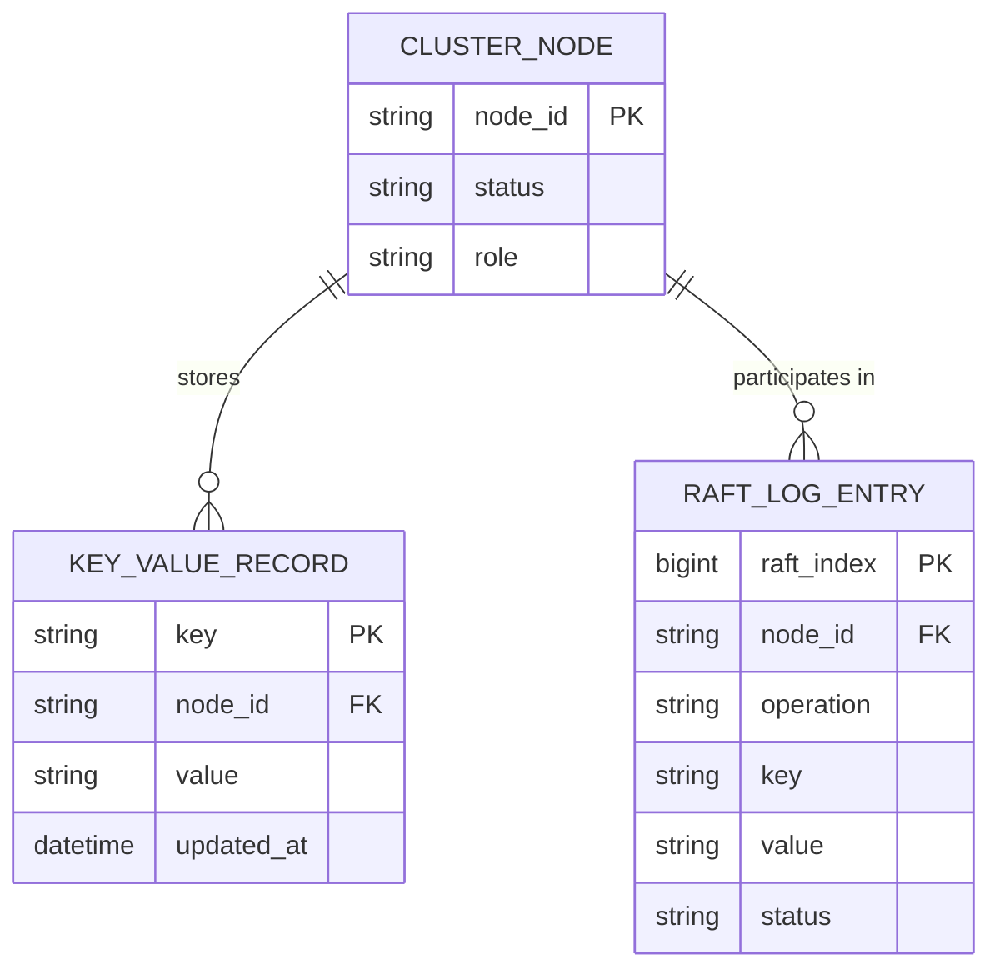

# ERD — Base (trước khi có WAL cục bộ per-node)

Đây là **base**: mô hình dữ liệu suy luận cho một node trong cụm KV store phân tán *trước khi* có WAL cục bộ. Đề bài giả định cluster đã có replication tầng cluster (Raft) và mỗi node lưu key-value — nếu không có sẵn các entity này thì yêu cầu "WAL cục bộ giảm tải phải rebuild từ replica" sẽ không có nghĩa. ERD chỉ dựng phần lõi phục vụ lưu trữ + đồng thuận cluster, không suy diễn thêm sharding, client SDK...

Ghi chú: ở base, khi 1 node crash, dữ liệu cục bộ của nó không có WAL riêng — node chỉ có thể phục hồi bằng cách rebuild toàn bộ từ replica qua network (chậm), đây là điểm yếu mà enhance khắc phục bằng WAL cục bộ.
