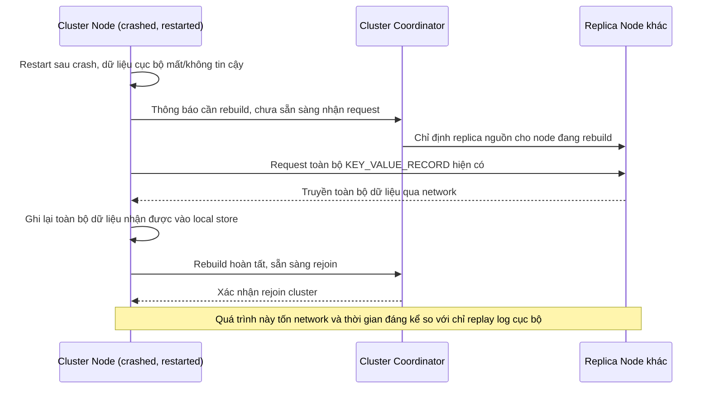

# Sequence Diagram — Base: Rebuild From Replica

Đây là **base**, flow phục hồi node duy nhất bằng cách rebuild toàn bộ từ replica qua network — cách duy nhất hiện có khi chưa có WAL cục bộ, tốn thời gian/network hơn hẳn và là tiền đề để so sánh với recovery nhanh bằng WAL cục bộ ở enhance.

