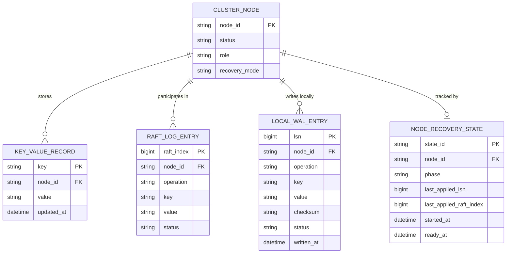

# ERD — Enhance (sau khi có WAL cục bộ per-node)

Đây là **enhance**: ERD base cộng với các entity phục vụ đúng 4 yêu cầu của đề bài — tự phục hồi từ WAL cục bộ trước khi rejoin, phát hiện WAL corrupt để fallback rebuild-from-replica, phối hợp giữa recovery cục bộ và Raft log, và đo lường thời gian phục hồi. So với base, `CLUSTER_NODE` nay có `recovery_mode` để phân biệt đang replay WAL cục bộ hay đang rebuild từ replica, và `LOCAL_WAL_ENTRY` là nguồn phục hồi ưu tiên trước khi chạm tới `RAFT_LOG_ENTRY`.

