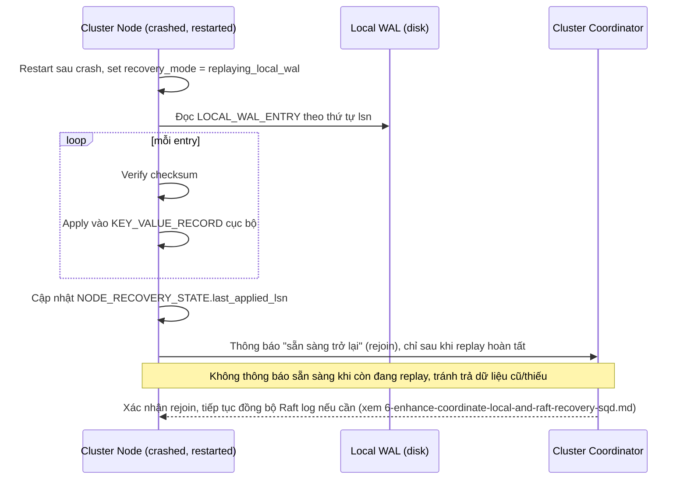

# Sequence Diagram — Enhance: Node Local WAL Recovery

Đây là **enhance**, flow mới hoàn toàn — thay thế con đường mặc định của base ([2-base-rebuild-from-replica-sqd.md](2-base-rebuild-from-replica-sqd.md)): node tự phục hồi từ WAL cục bộ trước, chỉ báo "sẵn sàng" với cluster sau khi replay xong, nhanh hơn hẳn so với rebuild qua network.

