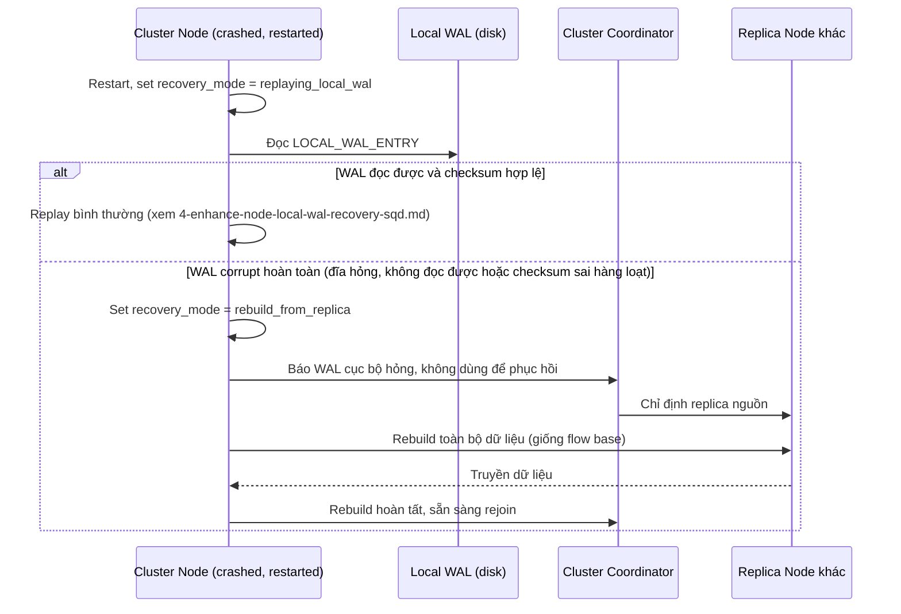

# Sequence Diagram — Enhance: Detect Corrupt WAL Fallback

Đây là **enhance**, flow mới xử lý yêu cầu: khi WAL cục bộ bị corrupt hoàn toàn (đĩa hỏng), node phải tự phát hiện và chuyển sang chế độ rebuild-from-replica (tái sử dụng flow base [2-base-rebuild-from-replica-sqd.md](2-base-rebuild-from-replica-sqd.md)) thay vì cố replay dữ liệu hỏng.

