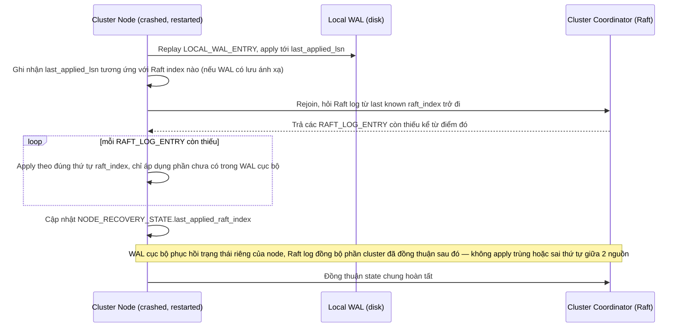

# Sequence Diagram — Enhance: Coordinate Local and Raft Recovery

Đây là **enhance**, flow mới xử lý yêu cầu phối hợp rõ ràng giữa recovery cục bộ (WAL) và recovery ở tầng cluster (Raft log) — không để 2 cơ chế mâu thuẫn nhau về thứ tự áp dụng thay đổi, đặc biệt quan trọng khi nhiều node cùng crash đồng thời (mất điện datacenter).

