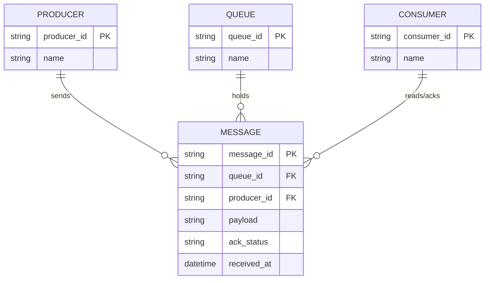

# ERD — Base (trước khi có WAL cho message queue)

Đây là **base**: mô hình dữ liệu suy luận cho message queue broker tự xây *trước khi* có WAL. Đề bài giả định đã có Producer gửi message, Queue giữ message trong bộ nhớ, và Consumer đọc + ack — nếu không có sẵn các entity này thì yêu cầu "ghi WAL trước khi ack cho producer, replay đúng trạng thái ack sau crash" sẽ không có nghĩa. ERD chỉ dựng phần lõi phục vụ produce/consume, không suy diễn thêm topic/partition, dead-letter queue...

Ghi chú: ở base, `MESSAGE` chỉ tồn tại trong bộ nhớ broker — nếu broker crash trước khi consumer kịp đọc, message mất hoàn toàn dù producer đã nhận ack. Đây chính là lỗ hổng mà WAL ở phần enhance khắc phục.
