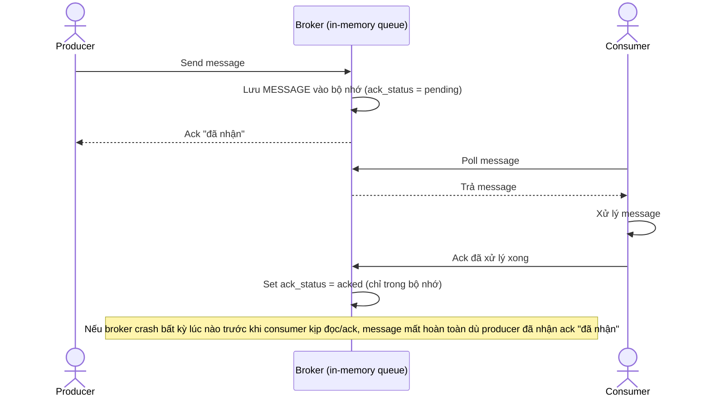

# Sequence Diagram — Base: Produce and Consume Message

Đây là **base**, flow gửi/nhận message chỉ dựa vào bộ nhớ (không WAL) — tiền đề để thấy rõ rủi ro mất message khi broker crash, chính là lý do đề bài yêu cầu thêm WAL.

