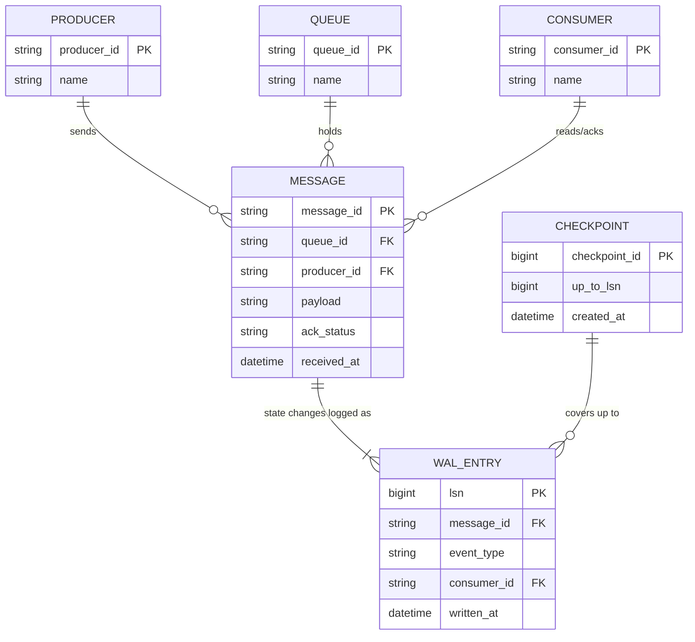

# ERD — Enhance (sau khi có WAL cho message queue)

Đây là **enhance**: ERD base cộng với các entity phục vụ đúng 4 yêu cầu của đề bài — chỉ ack producer sau khi WAL fsync, replay đúng thứ tự + trạng thái ack sau crash, redeliver message đang xử lý dở khi crash (đòi hỏi consumer idempotent), và checkpoint định kỳ cắt bớt WAL. So với base, mọi thay đổi trạng thái của `MESSAGE` (nhận, giao cho consumer, ack) đều được ghi thành `WAL_ENTRY` riêng biệt, không chỉ ghi lúc nhận như base.

