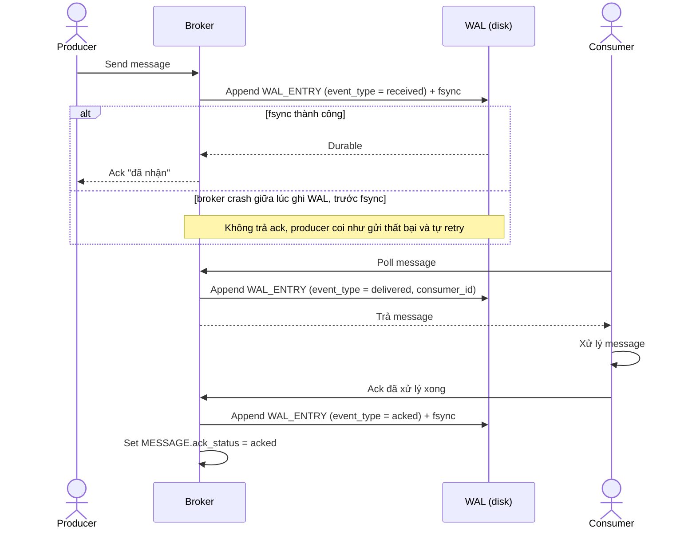

# Sequence Diagram — Enhance: Produce and Consume Message

Đây là **enhance**, flow đã thay đổi so với base ([2-base-produce-consume-message-sqd.md](2-base-produce-consume-message-sqd.md)): broker chỉ ack producer sau khi WAL fsync thành công, và mỗi bước giao message cho consumer / consumer ack đều ghi `WAL_ENTRY` riêng, thay vì chỉ tồn tại trong bộ nhớ như base.

