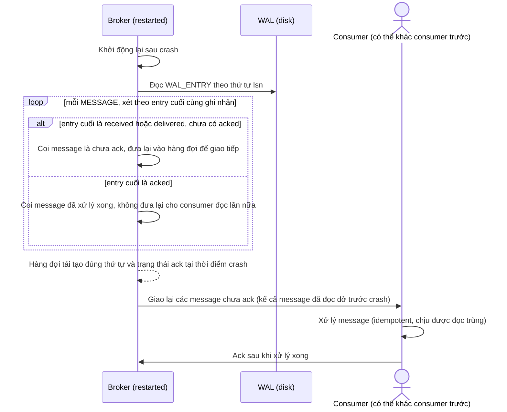

# Sequence Diagram — Enhance: Crash Recovery Replay Queue

Đây là **enhance**, flow mới hoàn toàn: sau crash, broker replay WAL để tái tạo đúng thứ tự hàng đợi và trạng thái ack, redeliver message đang xử lý dở khi crash cho consumer (có thể là consumer khác), đòi hỏi xử lý ở consumer phải idempotent.

