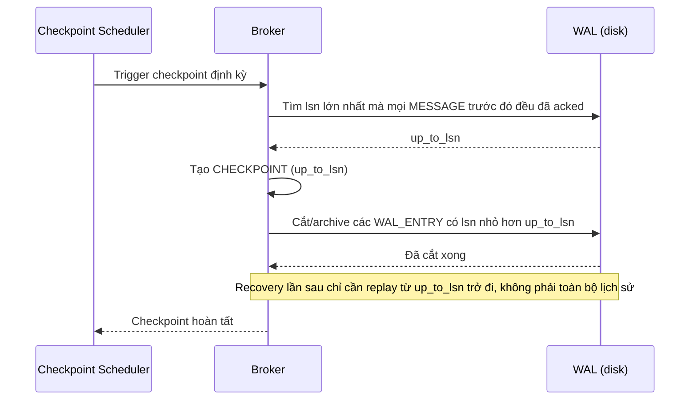

# Sequence Diagram — Enhance: Checkpoint Truncate WAL

Đây là **enhance**, flow mới xử lý yêu cầu checkpoint định kỳ cắt bớt phần WAL chứa toàn message đã được mọi consumer liên quan ack xong, tránh WAL phình vô hạn khiến recovery time ngày càng dài khi nhiều producer ghi đồng thời.

