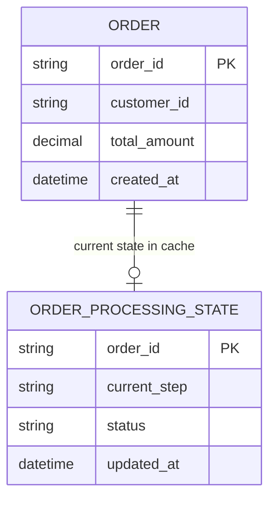

# ERD — Base (trước khi có WAL backup cho cache)

Đây là **base**: mô hình dữ liệu suy luận cho hệ thống xử lý đơn hàng *trước khi* có WAL backup. Đề bài mô tả rõ hiện trạng: trạng thái đơn hàng đang xử lý chỉ được giữ trong in-memory cache để tăng tốc, không có lớp ghi bền vững nào — đây chính là base, không cần suy luận thêm. ERD chỉ dựng phần lõi phục vụ trạng thái xử lý đơn hàng, không suy diễn thêm thanh toán, kho hàng, vận chuyển...

Ghi chú: ở base, `ORDER_PROCESSING_STATE` chỉ tồn tại trong in-memory cache — không có bản ghi bền vững nào tương ứng. Khi service crash/restart, toàn bộ state này mất sạch, không có cách nào biết đơn hàng nào đang ở bước nào. Đây chính là lỗ hổng mà WAL ở phần enhance khắc phục.
