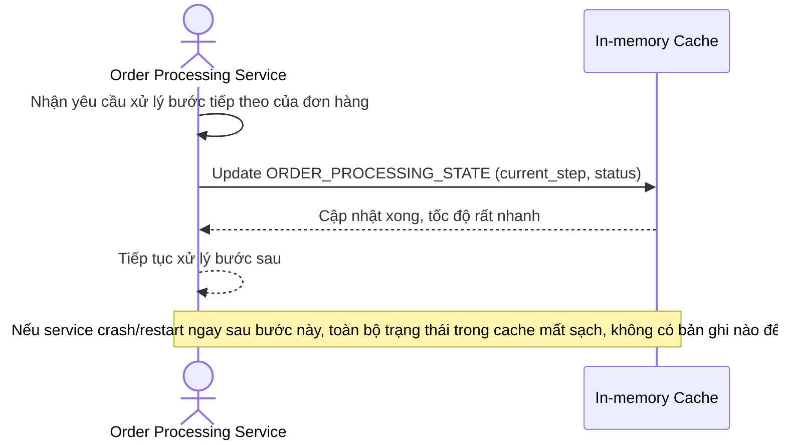

# Sequence Diagram — Base: Process Order Step

Đây là **base**, flow cập nhật trạng thái đơn hàng chỉ dựa vào in-memory cache, không có bất kỳ lớp ghi bền vững nào — tiền đề để thấy rõ rủi ro mất trạng thái xử lý khi service crash/restart.

