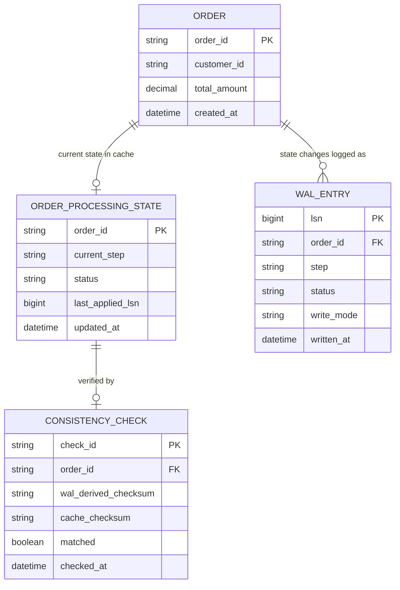

# ERD — Enhance (sau khi có WAL backup cho cache)

Đây là **enhance**: ERD base cộng với các entity phục vụ đúng 5 yêu cầu của đề bài — ghi WAL trước rồi mới cập nhật cache, replay WAL để rebuild cache khi restart, xử lý đúng thứ tự entry cuối cùng theo từng đơn, cân nhắc sync/batch write với RPO rõ ràng, và phát hiện lệch giữa WAL và cache. So với base, `ORDER_PROCESSING_STATE` trong cache nay luôn bắt nguồn từ `WAL_ENTRY` đã ghi trước đó, không còn là nguồn sự thật duy nhất.

