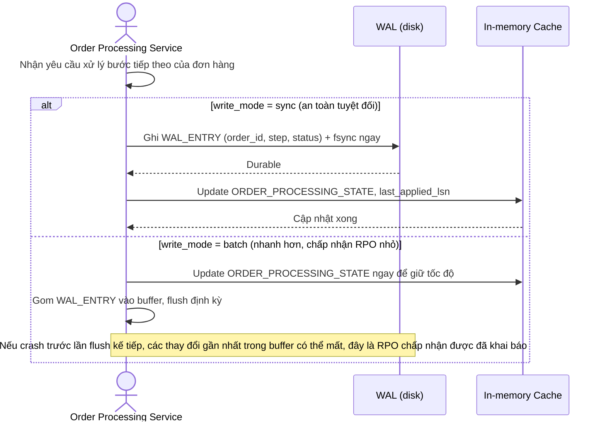

# Sequence Diagram — Enhance: Process Order Step

Đây là **enhance**, flow đã thay đổi so với base ([2-base-process-order-step-sqd.md](2-base-process-order-step-sqd.md)): thứ tự bắt buộc đảo ngược — ghi `WAL_ENTRY` trước, cập nhật in-memory cache sau, thay vì chỉ cập nhật cache như base. Sơ đồ cũng thể hiện lựa chọn giữa ghi WAL đồng bộ (an toàn tuyệt đối) và batch định kỳ (nhanh hơn, RPO khác 0).

