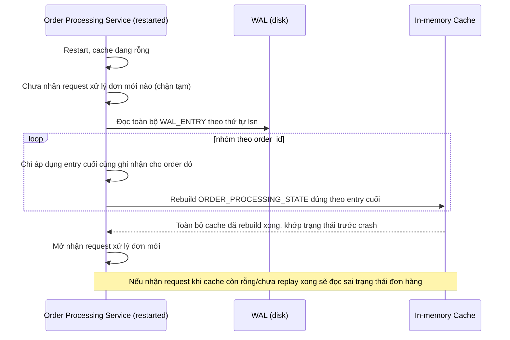

# Sequence Diagram — Enhance: Restart and Replay WAL

Đây là **enhance**, flow mới hoàn toàn: khi service restart, phải replay WAL rebuild lại toàn bộ in-memory cache về đúng trạng thái trước crash, xử lý đúng theo entry cuối cùng của từng đơn hàng, trước khi bắt đầu nhận request xử lý đơn mới.

