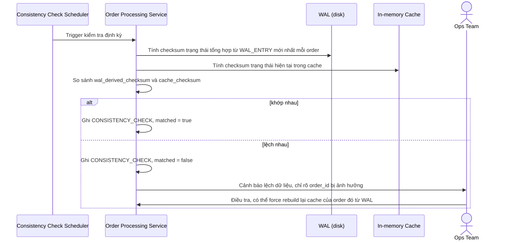

# Sequence Diagram — Enhance: Detect WAL-Cache Drift

Đây là **enhance**, flow mới xử lý yêu cầu phát hiện WAL và in-memory cache bị lệch nhau (ví dụ do bug ghi cache thất bại âm thầm dù WAL đã ghi đúng), thông qua kiểm tra định kỳ/checksum trạng thái tổng hợp.

